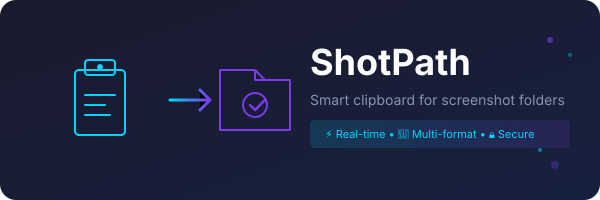

# ShotPath

<div align="center">



**Smart clipboard synchronization for Windows screenshot folders**

[](https://opensource.org/licenses/MIT)
[](#)
[](https://v2.tauri.app)
[](https://www.rust-lang.org)

*Monitoring your screenshot folder so you never have to manually copy again.*

</div>

---

## Overview

ShotPath is a lightweight Windows desktop utility that bridges the gap between screenshot files and clipboard content. It monitors a designated folder in real-time and automatically copies new images to your clipboard in multiple formats — so every paste is context-aware.

## The Problem It Solves

On Windows, screenshot workflows are fragmented:

| Screenshot Method | File Saved? | In Clipboard? |
|-------------------|:-----------:|:-------------:|
| `Win + Shift + S` | No | Yes |
| `Win + PrtSc` | Yes | No |
| `Snipping Tool` | Optional | Optional |

**You can't have both.** ShotPath fixes this.

## How It Works

```
┌─────────────────┐     ┌─────────────────┐     ┌─────────────────┐
│  Screenshot     │────▶│  ShotPath       │────▶│  Clipboard      │
│  Saved to File   │     │  Monitors       │     │  Multi-Format   │
└─────────────────┘     └─────────────────┘     └─────────────────┘
                              │
                              ▼
                    ┌─────────────────┐
                    │  Desktop        │
                    │  Notification   │
                    └─────────────────┘
```

When a new image is detected, ShotPath writes three formats simultaneously:

- **DIB (Image Data)** — Applications like Discord, Slack, Word paste the actual image
- **Unicode Text (Path)** — Editors like Notepad, VS Code paste the file path
- **File Drop List** — File Explorer allows paste-as-file operation

## Features

### Smart Multi-Format Clipboard
Sets Image, Unicode Text, and File Drop lists atomically. The receiving application chooses the best format automatically.

### Real-Time Monitoring
High-performance Rust-based filesystem watcher using `notify`. Detects new files within milliseconds.

### Native System Integration
- Runs silently in the system tray
- Single-click access to open UI or quit
- Desktop notifications on sync

### Intelligent File Handling
Wait-for-readiness logic ensures the OS has finished writing before clipboard operations — no truncated images.

### Lightweight & Secure
- Single ~3MB executable (Tauri + WebView2)
- No Electron overhead
- Minimal dependencies, minimal attack surface

## Installation

### Pre-built Installers

Download from [Releases](https://github.com/your-repo/shotpath/releases):

| Installer | Description |
|-----------|-------------|
| `shotpath_0.1.0_x64-setup.exe` | NSIS installer (~4MB) |
| `shotpath_0.1.0_x64_en-US.msi` | MSI for enterprise deployment |

### Build from Source

```bash
# Prerequisites
- Node.js 18+
- Rust 1.75+
- npm

# Install dependencies
npm install

# Run in development
npm run tauri dev

# Build for production
npm run tauri build
```

The built executable will be at `src-tauri/target/release/shotpath.exe`.

## Configuration

1. Launch ShotPath
2. Click **Browse Folder** and select your screenshot directory
3. Toggle **Enable Monitoring** to start watching
4. That's it — new screenshots now auto-copy to clipboard

### Config Location

Configuration is stored at:
```
%APPDATA%/shotpath/config.json
```

```json
{
  "folder_path": "C:\\Users\\YourName\\Pictures\\Screenshots",
  "enabled": true,
  "copy_mode": "path"
}
```

## Supported Formats

| Extension | Supported |
|-----------|:---------:|
| PNG | ✓ |
| JPEG / JPG | ✓ |
| WebP | ✓ |

## Technical Stack

| Layer | Technology | Purpose |
|-------|------------|---------|
| Framework | **Tauri 2.x** | Native binary, WebView2 rendering |
| Backend | **Rust** | Clipboard, filesystem, notifications |
| Frontend | **React + Vite** | Configuration UI |
| Clipboard | **clipboard-win** + **arboard** | Multi-format clipboard operations |
| Watcher | **notify** | Filesystem event monitoring |

## Architecture

```
shotpath/
├── src/                      # React frontend
│   ├── App.jsx               # Main UI component
│   ├── components/           # React components
│   └── styles/               # CSS styles
├── src-tauri/                 # Rust backend
│   └── src/
│       ├── main.rs           # Entry point
│       ├── lib.rs            # Library interface
│       ├── config.rs         # Config load/save
│       ├── watcher.rs        # Filesystem watcher
│       ├── clipboard.rs      # Clipboard operations
│       ├── tray.rs           # System tray
│       └── utils.rs          # Helpers
└── tauri.conf.json          # Tauri configuration
```

## Keyboard Shortcuts

| Shortcut | Action |
|----------|--------|
| `Win + Shift + S` | Windows Snip (not affected) |
| `Win + PrtSc` | Save screenshot + auto-copy |

## Contributing

Contributions welcome. Please open an issue first for major changes.

1. Fork the repository
2. Create your feature branch (`git checkout -b feature/amazing`)
3. Commit your changes (`git commit -m 'Add amazing feature'`)
4. Push to the branch (`git push origin feature/amazing`)
5. Open a Pull Request

## License

MIT License. See [LICENSE](LICENSE) for details.

---

<div align="center">

*Bringing macOS-style intelligent clipboard workflows to Windows.*

</div>
